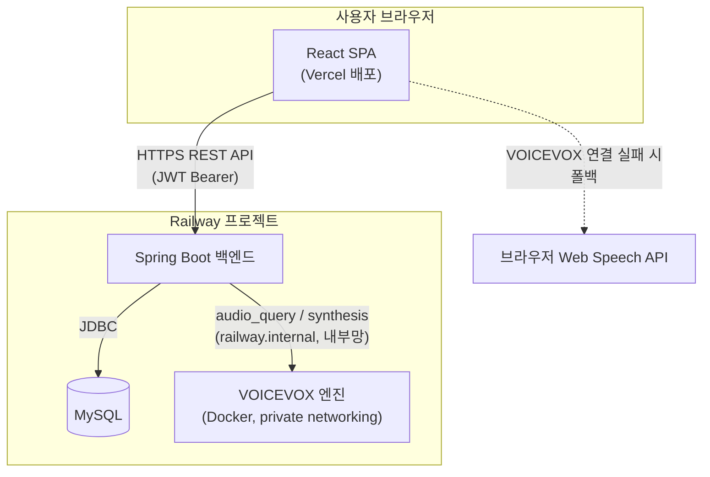
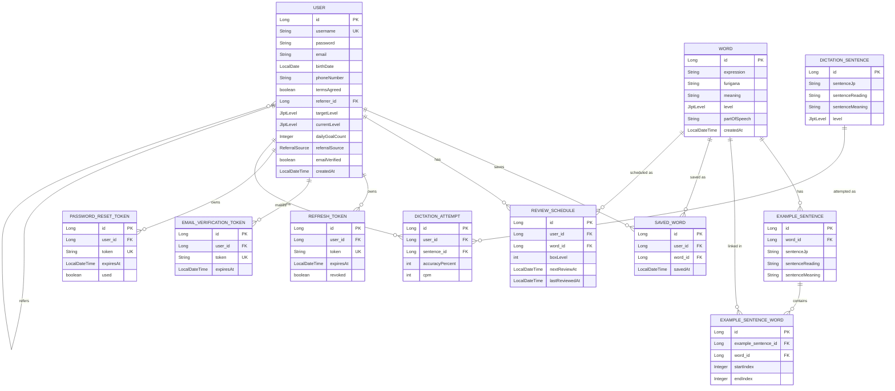
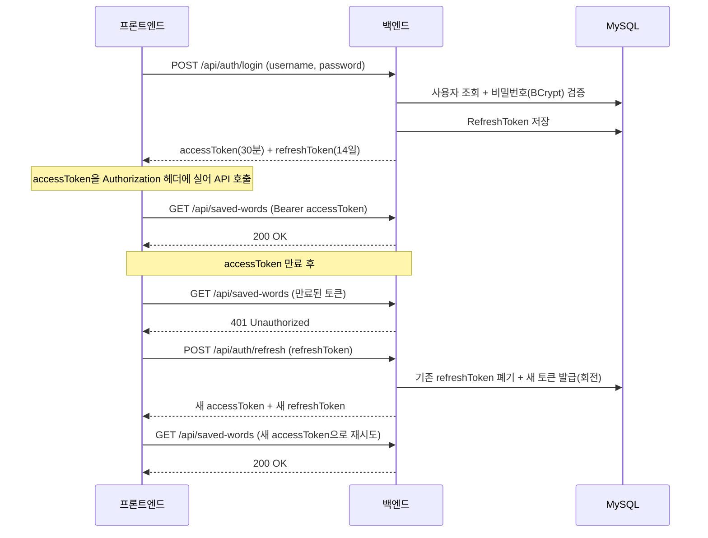

# 아키텍처 설계 문서 (JP Vocab)

일본어 단어장(JP Vocab) 프로젝트의 설계 문서. 시스템 구성, ERD, API 명세, 인증 흐름을 정리한다.

## 1. 기술 스택

| 영역 | 기술 |
|---|---|
| 백엔드 | Spring Boot 3.3.4, Java 21, Spring Data JPA/Hibernate, Spring Security 6 |
| 인증 | JWT(jjwt 0.12.6, HS256) 액세스 토큰 + DB 저장 리프레시 토큰(회전) |
| DB | MySQL 8 |
| 프론트엔드 | React 19, TypeScript, Vite, react-router-dom v7 |
| 음성 합성 | VOICEVOX(엔진 프록시) + 브라우저 Web Speech API(폴백) |
| 로마자 입력 | wanakana (로마자 → 히라가나 실시간 변환) |
| 배포 | Railway(백엔드 + MySQL + VOICEVOX 엔진), Vercel(프론트엔드) |

## 2. 시스템 아키텍처

- 프론트엔드는 VOICEVOX를 직접 호출하지 않는다. 백엔드가 프록시해서 speaker id/속도 등을 서버에서 통제하고, VOICEVOX 엔진 자체는 외부에 노출하지 않는다(내부망 전용).
- 백엔드가 VOICEVOX 엔진에 연결하지 못하면(꺼져있거나 미배포) `503`을 반환하고, 프론트엔드가 자동으로 브라우저 기본 TTS로 전환한다 — 단일 장애점을 만들지 않기 위한 설계.

## 3. ERD

설계 메모:
- `SAVED_WORD`, `REVIEW_SCHEDULE`은 `(user_id, word_id)` 복합 유니크 제약 — 같은 단어를 두 번 저장/스케줄링할 수 없다.
- `EXAMPLE_SENTENCE_WORD`는 `example_sentences.sentence_jp` 문자열 안에서 단어가 등장하는 위치(`startIndex`~`endIndex`)를 가리키는 매핑 테이블 — 프론트에서 예문 속 단어를 클릭 가능하게 만들기 위함.
- `DICTATION_SENTENCE`는 `EXAMPLE_SENTENCE`와 완전히 분리된 테이블. 단어 학습용 예문과 듣기 연습용 문장은 요구되는 길이/난이도가 달라서 의도적으로 분리했다.
- `RefreshToken`/`EmailVerificationToken`/`PasswordResetToken`은 전부 JWT가 아니라 DB에 저장되는 불투명 토큰이다 — 서버 쪽에서 명시적으로 폐기(revoke)할 수 있어야 하기 때문(액세스 토큰은 상태 없이 만료로만 무효화됨).

## 4. API 명세

인증 열의 표기: **공개**(토큰 불필요) / **선택**(있으면 활용, 없어도 동작) / **필수**(JWT 없으면 401).

### 4.1 `/api/auth` — 인증/회원

| Method | Path | 인증 | 요청 | 응답 |
|---|---|---|---|---|
| POST | `/signup` | 공개 | `SignupRequest` | `201` `SignupResponse` |
| POST | `/login` | 공개 | `LoginRequest` | `LoginResponse`(액세스+리프레시 토큰) |
| POST | `/refresh` | 공개(리프레시 토큰이 자격증명) | `RefreshRequest` | `LoginResponse`(토큰 회전) |
| POST | `/logout` | 공개 | `RefreshRequest` | `204` |
| POST | `/verify-email` | 공개 | `VerifyEmailRequest` | `MessageResponse` |
| POST | `/find-username` | 공개 | `FindUsernameRequest` | `FindUsernameResponse` |
| POST | `/password-reset/request` | 공개 | `PasswordResetRequestRequest` | `PasswordResetRequestResponse` |
| POST | `/password-reset/confirm` | 공개 | `PasswordResetConfirmRequest` | `MessageResponse` |

### 4.2 `/api/words` — 단어

| Method | Path | 인증 | 응답 |
|---|---|---|---|
| GET | `/random?level=` | 선택 | `WordCardResponse`(로그인 시 `isSaved` 정확히 계산) |
| GET | `/{wordId}` | 선택 | `WordDetailResponse`(예문 + 클릭 가능한 단어 링크 포함) |
| GET | `/?level=&keyword=&page=&size=` | 선택 | `WordPageResponse`(페이지네이션 + 검색). `keyword`는 표제어·후리가나·뜻 중 어디든 부분 일치 |

### 4.3 `/api/saved-words` — 내 단어장 (전부 필수)

| Method | Path | 요청 | 응답 |
|---|---|---|---|
| POST | `/` | `SaveWordRequest` | `201` `SavedWordResponse` |
| GET | `/` | - | `List<SavedWordListItemResponse>` |
| DELETE | `/{savedWordId}` | - | `204` |

### 4.4 `/api/reviews` — 복습(라이트너 박스, 전부 필수)

| Method | Path | 요청 | 응답 |
|---|---|---|---|
| GET | `/due` | - | `List<ReviewWordResponse>` |
| GET | `/due/count` | - | `ReviewDueCountResponse` |
| POST | `/{wordId}/result` | `ReviewResultRequest` | `ReviewWordResponse`(갱신된 박스 레벨) |

### 4.5 `/api/dictation` — 딕테이션 / 타자연습

| Method | Path | 인증 | 요청 | 응답 |
|---|---|---|---|---|
| GET | `/random?level=` | 공개 | - | `DictationSentenceResponse`(정답 읽기 제외) |
| GET | `/practice-random?level=` | 공개 | - | `TypingPracticeSentenceResponse`(정답 포함 — 타자연습은 정답을 미리 보여줌) |
| POST | `/{sentenceId}/attempt` | 선택 | `DictationAttemptRequest` | `DictationAttemptResponse`(정확도/CPM/정답, 로그인 시에만 기록 저장) |
| GET | `/history` | 필수 | - | `List<DictationHistoryItemResponse>` |

### 4.6 `/api/tts` — 음성 합성

| Method | Path | 인증 | 요청 | 응답 |
|---|---|---|---|---|
| POST | `/speak` | 공개 | `TtsSpeakRequest(text, speedScale?, voice?)` | `audio/wav` 바이너리 |

## 5. 인증 흐름

핵심 설계 포인트:
- **토큰 회전(rotation)**: `/refresh` 호출마다 기존 리프레시 토큰은 폐기되고 새 토큰이 발급된다. 탈취된 리프레시 토큰이 재사용되면(이미 폐기됨) 감지 가능한 구조.
- **선택적 인증(Optional auth)**: `JwtAuthenticationFilter`는 토큰이 없거나 유효하지 않아도 요청을 막지 않는다 — `SecurityContext`를 비워둔 채 통과시키고, 실제 차단은 `SecurityConfig`의 `authorizeHttpRequests` 규칙이 담당한다. 이 덕분에 단어 조회·딕테이션처럼 "로그인 여부와 무관하게 쓸 수 있지만 로그인하면 더 잘 동작하는" 엔드포인트를 하나의 컨트롤러 코드로 구현할 수 있다(`SecurityUtils.getCurrentUserId(): Optional<Long>`).
- **프런트엔드 자동 재시도**: `api/client.ts`가 401 응답을 감지하면 자동으로 `/refresh`를 호출하고, 성공 시 원래 요청을 새 토큰으로 1회 재시도한다. 동시에 여러 요청이 401을 맞아도 `/refresh`는 한 번만 나가도록 진행 중인 refresh Promise를 공유한다(`refreshInFlight`).
